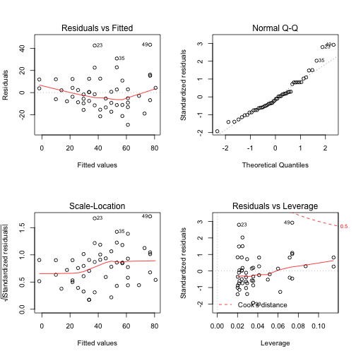
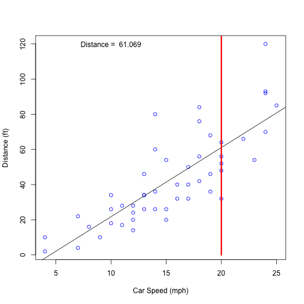

## Introduction

* We want to create a prediction model to determine the stopping distance of a car knowing the speed.
* We will use the "Cars" dataset from the "Datasets" package
* The Data has 50 observations and 2 variables: speed (mph) and dist (ft)


```r
library(datasets)
data("cars")
summary(cars)
```

```
##      speed           dist       
##  Min.   : 4.0   Min.   :  2.00  
##  1st Qu.:12.0   1st Qu.: 26.00  
##  Median :15.0   Median : 36.00  
##  Mean   :15.4   Mean   : 42.98  
##  3rd Qu.:19.0   3rd Qu.: 56.00  
##  Max.   :25.0   Max.   :120.00
```

---  

## Fitting a Model

* For our prediction algorithm we will fit a basic linear model which relates Speed and Distance
* We can take a look a the coefficients to analyze the model
* in the next slide we will analyze some plots


```r
mdl <- lm(dist ~ speed, data = cars)
summary(mdl)$coef
```

```
##               Estimate Std. Error   t value     Pr(>|t|)
## (Intercept) -17.579095  6.7584402 -2.601058 1.231882e-02
## speed         3.932409  0.4155128  9.463990 1.489836e-12
```

---

## Model Analysis


```r
par(mfrow=c(2,2))
plot(mdl)
```



---

## Predicting new values

* We use the predict function to calculate new values using our linear model. For example, with a speed of 20 mph we would get these results


```r
userspeed <- 20; 
dist <- predict(mdl, newdata = data.frame(speed=userspeed))
print(dist)
```

```
##        1 
## 61.06908
```

---

## Ploting the Results


```r
plot(cars$speed, cars$dist, xlab="Car Speed (mph)", ylab = "Distance (ft)",
     col="blue") 
abline(mdl); lines(c(userspeed, userspeed), c(0, 200),col="red",lwd=3)
text(10, 120, paste("Distance = ", round(dist, digits = 3)))
```


